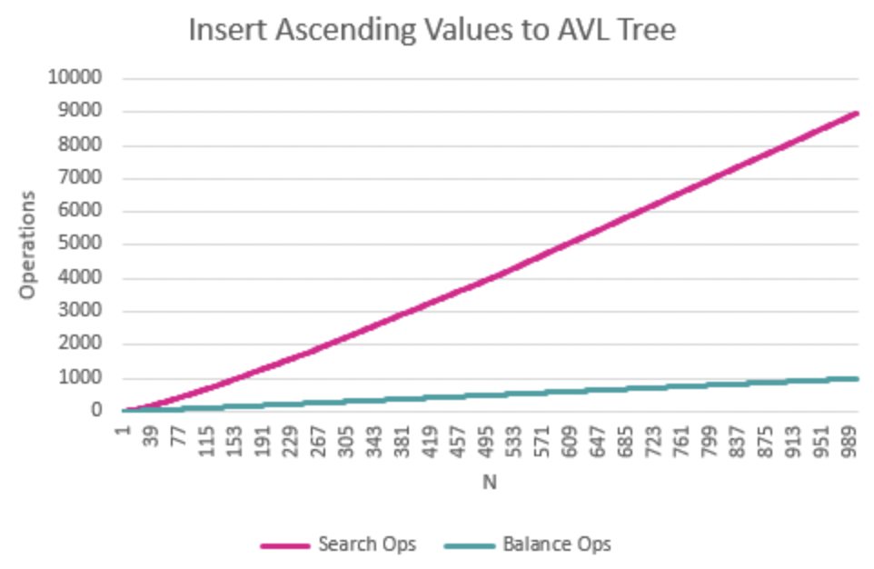
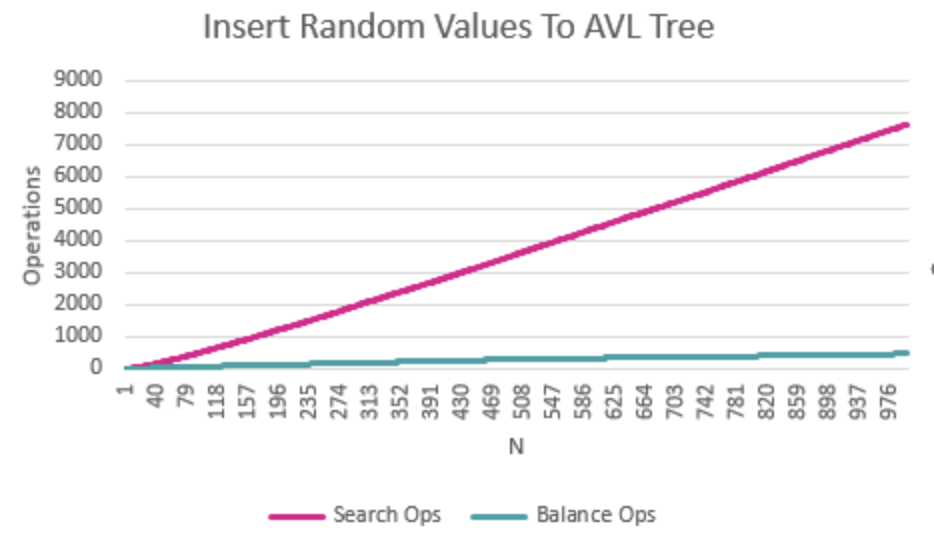

# Research Paper
* Name: Aliya Salmanova
* Semester: Fall 2025
* Topic: CS 5008 Data Structures, Algorithms, and Their Applications within Computer Systems


## Introduction

This report is on the AVL Tree,
an algorithm that accomplishes ensuring that a binary search tree is balanced at all times.
This means the difference between the height of the left and right subtree for each node in the binary search tree is not greater than 1. 

In an unbalanced binary search tree, the height depends on the insertion order. If values are inserted in sorted order, the tree becomes a long chain on one side, effectively behaving like a linked list. In that case, insertions, searches, and deletions degrade from the usual O(log n) to O(n) in the worst case. Balanced trees, including the AVL Tree, solve this problem. 

Implementing a balanced binary search tree lets us accomplish not hitting the worst case scenario, 
allowing all these operations to be at worst still O(log n), as we do not risk 
the tree being slanted right or left. 

The AVL Tree was introduced by two Soviet Mathematicians, G. M. Adel'son-Vel'skii and E. M. Landis,
in their paper, "An Algorithm for the Organization of Information". [^1]
This was the first algorithm that provides a way to balance a binary search tree. 
Later, in 1972, Rudolf Bayer, a German Computer Scientist, came up with the Red-Black Tree 
(originally named symmetric binary B-tree), another commonly used bst balancing algorithm. 

In this report, I will be focused specifically on the AVL Tree. 
I will explain the time and space complexity of the AVL Tree algorithm,
analyse the empirical data gathered by tracking the amount of node visits 
during insertions to an AVL Tree and the operations performed to keep the tree balanced, 
and will provide some examples of instances in which this algorithm is used.


## Analysis of Algorithm/Datastructure

The time complexity of inserting into an AVL Tree is O(log n), or otherwise written as O(h), 
the h representing the height of the tree. 
This is because the height of a tree is log2 n, as at each level in a balanced tree,
the amount of nodes is twice greater than the previous level, until we 
get the the bottom level, which has n/2 nodes. 
Inserting into an AVL Tree requires searching for where to insert the tree,
which means following down the height of the tree. 
The operations made to keep the tree balanced add O(1) time.
We will see this in the empirical data and analysis. 

The space complexity of the AVL Tree itself is O(n), as each value inserted into the tree always gets mapped 
to one node. This node struct has a value, a left pointer, a right pointer, 
and a height showing at which height of the tree it's at. 
We need this to perform the balancing.

However, when implementing the algorithm recursively, we need to also count O(log n) for the space
on the stack. This is because with recursion the space usage refers to the amount of calls on the call stack.
The amount of recursive calls never exceeds O(h), the h being the height of the tree, 
which is equivalent to O(log n). So, the insertion algorithm itself is O(log n) space,
while the data structure of the tree is O(n) space. 


## Empirical Analysis

Data taken from running the algorithm while inserting ascending numbers from 1-1000 into the tree:


| N    | Search Ops | Balance Ops | Total Ops | log2(N) | Search Ops / N | Balance Ops / N | Total Ops / N |
| ---- | ---------: | ----------: | --------: | ------: | -------------: | --------------: | ------------: |
| 1    |          0 |           0 |        0  |   0.00  |          0.000 |           0.000 |         0.000 |
| 2    |          1 |           0 |        1  |   1.00  |          0.500 |           0.000 |         0.500 |
| 3    |          3 |           1 |        4  |   1.58  |          1.000 |           0.333 |         1.333 |
| 4    |          5 |           1 |        6  |   2.00  |          1.250 |           0.250 |         1.500 |
| 5    |          8 |           2 |       10  |   2.32  |          1.600 |           0.400 |         2.000 |
| 6    |         11 |           3 |       14  |   2.58  |          1.833 |           0.500 |         2.333 |
| 7    |         14 |           4 |       18  |   2.81  |          2.000 |           0.571 |         2.571 |
| 8    |         17 |           4 |       21  |   3.00  |          2.125 |           0.500 |         2.625 |
| 9    |         21 |           5 |       26  |   3.17  |          2.333 |           0.556 |         2.889 |
| 10   |         25 |           6 |       31  |   3.32  |          2.500 |           0.600 |         3.100 |
| 15   |         45 |          11 |       56  |   3.91  |          3.000 |           0.733 |         3.733 |
| 16   |         49 |          11 |       60  |   4.00  |          3.062 |           0.688 |         3.750 |
| 25   |         94 |          20 |      114  |   4.64  |          3.760 |           0.800 |         4.560 |
| 32   |        129 |          26 |      155  |   5.00  |          4.031 |           0.812 |         4.844 |
| 50   |        237 |          44 |      281  |   5.64  |          4.740 |           0.880 |         5.620 |
| 64   |        321 |          57 |      378  |   6.00  |          5.016 |           0.891 |         5.906 |
| 100  |        573 |          93 |      666  |   6.64  |          5.730 |           0.930 |         6.660 |
| 128  |        769 |         120 |      889  |   7.00  |          6.008 |           0.938 |         6.945 |
| 150  |        945 |         142 |     1087  |   7.23  |          6.300 |           0.947 |         7.247 |
| 225  |       1545 |         217 |     1762  |   7.81  |          6.867 |           0.964 |         7.831 |
| 256  |       1793 |         247 |     2040  |   8.00  |          7.004 |           0.965 |         7.969 |
| 500  |       3989 |         491 |     4480  |   8.97  |          7.978 |           0.982 |         8.960 |
| 750  |       6477 |         740 |     7217  |   9.55  |          8.636 |           0.987 |         9.623 |
| 1000 |       8977 |         990 |     9967  |   9.97  |          8.977 |           0.990 |         9.967 |


From the table, we can see that as N doubles, 
the search operations divided by N increases approximately by 1.
For example, search ops/n for 25 is 3.760, and for 50 it is 4.740. 
The balance ops increases every N by either 1 or 0. 
However, the balance operation happens during searching, and is O(1) time, 
so the balancing part of the algorithm is O(1).

The search and balance operation counts together support the theory that inserting into an AVL tree has a runtime of O(log n), 
as the height of the tree grows proportionally to log2 n.

The Balance Ops / N column is also consistent with known amortized analysis from literature. 
Mehlhorn and Tsakalidis analyze insertions into AVL Trees and show that 
over any sequence of n insertions into an an AVL Tree, 
the total number of balance changes (rotations and height updates) is at most 2.618n. [^6]

Below I have included 3 graphs showing the search operations and balance operations 
for nodes with values 1-1,000 inserted in ascending order,
descending order, and nodes inserted with random values that can be from 1-1,000.

As we can see, the runtime increase of these operations is very similar in all three graphs,
showing that in AVL Trees having the nodes already sorted before inserting them does not lead 
to a different runtime like it would if we were using an unbalanced binary search tree. 







You can see that the balancing operations count, as well as the search count 
rises less in the inserting random values. This is because when choosing random values from 1-1,000,
we are not avoiding duplicates. Trying to insert a duplicate would lead us to return the tree as is
and not have to perform any balancing. It also will keep the tree smaller than the other two,
as in the ascending and descending experiments, all nodes are bound to get added to the tree.


A more mathematical way to see why the height is of an AVL Tree is O(log n) is to look at the minimum number of nodes an AVL Tree of a given height. Let N(h) be the minimum number of nodes in any AVL Tree of height h.

Because of the AVL balance condition, the thinnest AVL Tree of height h has:
- one child subtree of height h - 1
- the other child subtree of height h - 2

(If the height difference were bigger than 1, it would not be an AVL Tree).

This gives the recurrence:
N(0) = 1
N(h) = 1 + N(h - 1) + N(h - 2) for h >= 1

From this, we can show that:
N(h) >= 2^(h/2)

So if the tree has n nodes, then:
n >= 2^(h/2)  resulting in  h <= 2 * log2(n)


## Application

Balanced binary search trees, including AVL Trees, can be used whenever it is needed to maintain a set of keys in sorted order 
while supporting fast search, insertion, and deletion operations at the same time. 
The main goal is to keep operations close to O(log n) even as the data structure grows, 
instead of degenerating to O(n) like an unbalanced binary search tree.

This data structure is still used in file systems to store 
directories and files. [^2] This prevents the system from scanning the whole directory in order to find a certain file
or nested directory. 
They are also often used in databases for these same reasons. 
A sorted linked list, sorted vector, and unbalanced BSTs have a worst case scenario insertion of O(n) time,
giving the balanced BST an advantage.

They are also used to implement dictionaries, maps, and sets. [^3]
In these structures, keys must remain sorted (to support operations like iterating over all keys in 
order or finding the smallest key greater than x, etc), 
and the data structure must handle frequent inserts and deletions.

Another interesting area balanced binary search trees such as AVL Trees are used is game development. [^8] 
This data structure keeps data ordered and shallow (not tall or lean), so games can quickly insert, remove, 
and find objects (like items, or game states) in O(log n) time even as the world changes every frame. 
The same idea of keeping a tree roughly balanced also appears in dynamic AABB trees used for collision detection, where organizing bounding boxes in a tree cuts down how many object pairs need to be checked. [^9] 
It is also said that AVL Trees are used in storyline games. [^4] 
However, some sources indicate that in branching narrative or dialogue systems, story states and choices are often modeled as a tree or graph of scenes (to support multiple directions). [^7] 
Still, game engines could use this structure internally to index these scenes by id or name, or for AI decision trees. [^4] 


## Implementation

I implemented this algorithm in C in [avl.h](/avl.h). 
I used only two of the most common libraries in c - <stdlib.h> and <stdio.h>. 

Besides the insertion algorithm, I also created a function to search for a node in the AVL Tree 
and to delete a node from the AVL Tree,
though in this report I am mostly focused on creating and inserting into an AVL Tree. 
All these functions are tested on different sized trees in [test.c](/test.c).

I faced a few challenges during the implementation. 
Firstly, it was difficult at first to fully conceptualize the logic of this algorithm.
In a way, it is similar to merge-sort, as you recurse down the tree to find where to insert, 
and then move back upward along your recursive calls, now performing the balance operations if needed.

A challenge was making sure the 4 cases of rotations are accurately written according to the balance factor.
It is easy to get confused about what the case is according to the height differences between the left and right children of the nodes. 

This algorithm is also quite long and so I split it into two functions - finding where to insert and 
checking and performing the balance operations. 

This is the psuedocode for my implementation: 

```
INSERT_TO_AVL_TREE(root, node)
    Input: root node of the BST, node to insert
    Output: updated root of the BST after insertion of node
    # recursively find where to insert node
    #base case: we hit null where node needs to be inserted
    if tree == NULL || nodeToInsert == NULL 
        return nodeToInsert;
    #Case 1 (recursive): if node->val is belongs on left side of tree
    if nodeToInsert->val < tree->val
        tree->left = insertToAVLTree(tree->left, nodeToInsert);
    #Case 2 (recursive): if node->val is belongs on right side of tree
    else if nodeToInsert->val > tree->val
        tree->right = insertToAVLTree(tree->right, nodeToInsert, searchOps, balanceOps);  
    #Case 3: if node->val is root->val we avoid duplicates
    else 
        return tree;
    
    #once we recursively to the bottom of the tree this can run to balance tree

    #recalculate height of tree
    tree->height = recalculateHeightOfTree(tree);

    #get the balance of the root and children
    int balance = getBalance(root);
    int balanceOfLeft = getBalance(root->left);
    int balanceOfRight = getBalance(root->right);

    #Case 1 (Left-Left/LL): root and its left child are both left heavy
    if balance > 1 && balanceOfLeft >= 0
        return rightRotate(root, balanceOps); #rotated right
    
    #Case 2 (Right-Right/RR): root and its right child are both right heavy
    else if balance < -1 && balanceOfRight <= 0
        return leftRotate(root, balanceOps); #rotated left
    
    #Case 3 (Left-Right/LR): root is left heavy but its left child is right heavy
    else if balance > 1 && balanceOfLeft <= 0
        root->left = leftRotate(root->left, balanceOps); #rotated left child left
        return rightRotate(root, balanceOps); #rotated root right
    
    #Case 4 (Right-Left/RL): root is right heavy but its right child is left heavy
    else if balance < -1 && balanceOfRight >= 0
        root->right = rightRotate(root->right, balanceOps); #rotated right child right
        return leftRotate(root, balanceOps); #rotated root left
    
    return root; #return updated root
```

*For the implementation of this algorithm, I pushed myself to do the implementation on my own,
but checked with the Python implementation occasionally to make sure I am on the right track. [^5]

To prove that the algorithm is correct, we need to show 
that it preserves the binary search tree property (the right side of a node always contains 
greater values, and the left always contains smaller values), 
and that the the AVL balance invariant is preserved, 
meaning that the height difference is at most 1 at every node.

Proof by induction:

Base case: If the tree is empty, inserting a single node creates a tree with one node,
whose left and right pointers are NULL, so the BST property and AVL balance invariant clearly holds.

Inductive hypothesis: 
For every AVL Tree of height h, we will assume that inserting a value with this algorithm returns a valid AVL Tree.

Inductive step: 
Now we will take an AVL Tree of height h + 1 with root value r and insert a value x.
- if x < r, we recursively insert into the left subtree
- if x > r, we recursively insert into the right subtree
- if x == r, we return the tree unchanged
By the inductive assumption, the subtree we recurse into is still an AVL Tree after insertion. That means the binary search ordering is preserved there, and all its nodes are still balanced. After the recursive call, we update the heights on the path back to the root. If every node on that path still has left and right subtree heights that differ by at most 1, we are done. If some node becomes unbalanced (difference is 2), its children must match one of the four standard AVL cases (LL, RR, LR, RL). The corresponding single or double rotation is a local change that restores the height difference at that node to at most 1 and does not change the in-order order of the values, so the binary search tree property still holds. Subtrees below were already AVL by the inductive assumption, and subtrees above cannot become worse when the height is reduced or stays the same. Therefore the final tree is again a valid AVL Tree.

By induction on the height, AVL insertion is correct for all AVL Trees.


## Summary

Implementing this algorithm gave me more practice with large recursive functions and programs, 
which can be tricky to visualize and write smoothly.
I also practiced thorough testing and handling appending data to files. 
The testing and the runner code, as well as the algorithm implementation itself,
helped solidate my knowledge gained in this course about pointers and freeing memory.
Although the empirical data showing O(log n) time was expected and not surprising, 
I was surprised that there were such few balancing operations getting performed.
This was very interesting to me and I had to go through and walk through the algorithm again to see how this would work. 
The empirical data helped confirm how efficient this algorithm is if trying to avoid worst case 
runtime of operations on a binary search tree. 
I also learned some history about the AVL Tree and red black tree through research on this algorithm,
such as when it was created and how its usage has evolved throughout the years. 
I am curious to explore further on how a Red Black Tree compares to an AVL Tree. 

Something I think that could've been better with this analysis, is that I could've made sure the random 
values being inserted to the AVL Tree are not duplicates. 
Making it possible to have duplicates in the random inserts run makes it differ from the 
experiment of inserting ascending values and inserting descending values within the same range.


## Sources:

[^1]: Adel’son-Vel’skii, G. M., & Landis, E. M. (1962). AN ALGORITHM FOR THE ORGANIZATION OF INFORMATION. Soviet Mathematics Doklady. 

[^2]: How to optimize the database indexing using AVL trees. Educative. (n.d.). http://www.educative.io/answers/how-to-optimize-the-database-indexing-using-avl-trees 

[^3]: Pfenning, F. (2015, March 19). Lecture notes on AVL trees 15-122: Principles of Imperative Computation. https://www.cs.cmu.edu/~rjsimmon/15122-s15/lec/17-avl.pdf 

[^4]: Ghosh, A. K. (n.d.). AVL tree in data structures with examples. http://www.scholarhat.com/tutorial/datastructures/avl-tree-in-data-structures 

[^5]: W3schools.com. W3Schools Online Web Tutorials. (n.d.). https://www.w3schools.com/dsa/dsa_data_avltrees.php  

[^6]: Mehlhorn, K., & Tsakalidis, A. (1986). An amortized analysis of insertions into AVL-trees. SIAM Journal on Computing, 15(1). 

[^7]: O. Riedl , M., & Young, R. M. (n.d.). From Linear Story Generation to Branching Story Graphs. https://faculty.cc.gatech.edu/~riedl/pubs/riedl-aiide05.pdf 

[^8]: HeyCoach. (n.d.). AVL Tree in Game Development. https://blog.heycoach.in/avl-tree-in-game-development/ 

[^9]: Chou, M.-L. “Allen.” (2014, September 15). Game physics: Broadphase – Dynamic Aabb Tree. https://allenchou.net/2014/02/game-physics-broadphase-dynamic-aabb-tree 